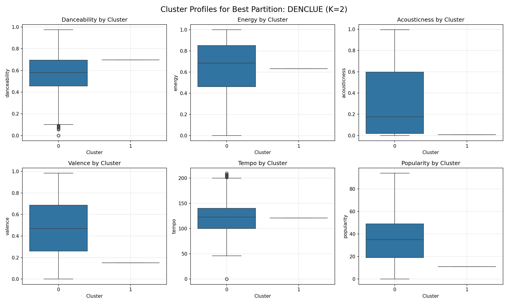

# Studiu Comparativ de Clusterizare pe Spotify Tracks

Acest raport reprezintă studiul comparativ realizat pe setul de date **Spotify Tracks Dataset** conform cerințelor din **CerinteProiect.pdf (Secțiunea A. Clusterizare)**. Analiza a fost realizată folosind un eșantion reprezentativ de 3000 melodii, selectate prin eșantionare stratificată pe baza genurilor muzicale, pentru a permite rularea eficientă a tuturor algoritmilor.

## 1. Descrierea Datelor și Preprocesarea

Setul de date conține caracteristici audio extrase prin API-ul Spotify. Pentru realizarea analizei de clusterizare, au fost selectate următoarele **15 atribute numerice**:
- `popularity` (Popularitatea piesei)
- `duration_ms` (Durata în milisecunde)
- `danceability` (Cât de potrivită este piesa pentru dans)
- `energy` (Intensitatea și activitatea piesei)
- `key` (Gama piesei, transpusă numeric)
- `loudness` (Volumul mediu în decibeli)
- `mode` (Modul major/minor)
- `speechiness` (Prezența cuvintelor vorbite)
- `acousticness` (Probabilitatea ca piesa să fie acustică)
- `instrumentalness` (Probabilitatea ca piesa să fie exclusiv instrumentală)
- `liveness` (Prezența unui public în înregistrare)
- `valence` (Pozitivitatea muzicală/veselia piesei)
- `tempo` (Viteza piesei în BPM)
- `time_signature` (Măsura piesei)
- `explicit` (Variabilă booleană, convertită în 0 sau 1)

**Preprocesare**:
1. Eliminarea înregistrărilor cu valori lipsă.
2. Eliminarea duplicatelor bazate pe `track_id` pentru a preveni distorsiuni.
3. Eșantionare stratificată: selectarea a 26 melodii din fiecare dintre cele 125 de genuri disponibile pentru a menține echilibrul claselor în subsetul de date de 3000 melodii.
4. Standardizare numerică completă folosind `StandardScaler` (pentru a aduce toate caracteristicile la medie 0 și deviație standard 1, pas esențial pentru algoritmi distanțiali).

---

## 2. Metodologia și Algoritmii Aplicați

Au fost implementați și comparați **17 algoritmi de clusterizare**, grupați în 6 categorii (incluzând 2 algoritmi suplimentari pentru a crește profunzimea studiului):

1. **Modele de tip partiționare**:
   - **K-Means**: Initializează centroizi și asociază instanțele cu cel mai apropiat centroid.
   - **Bisecting K-Means**: Abordare ierarhică divizivă a K-Means.
   - **K-Medoids**: Similar cu K-Means, dar utilizează instanțe reale din setul de date ca centre (medoizi), fiind mai robust la outlieri.
2. **Modele de tip probabilistic**:
   - **Gaussian Mixture (EM)**: Modelează datele ca o combinație de mai multe distribuții normale multivariate, determinând probabilități de apartenență.
3. **Modele ierarhice (Agglomerative)**:
   - **Ward**: Minimizează varianța totală din interiorul clusterilor.
   - **Legătură Completă (Complete Linkage)**: Utilizează distanța maximă dintre puncte.
   - **Legătură Simplă (Simple Linkage)**: Utilizează distanța minimă dintre puncte.
   - **Media Legăturilor (Average Linkage)**: Utilizează distanța medie.
   - **Centroid**: Distanța dintre centroizii clusterilor.
4. **Modele bazate pe densitate**:
   - **DBSCAN**: Clusterizează pe baza densității locale (core points), marcând punctele izolate ca noise (-1).
   - **OPTICS**: Extinde DBSCAN prin crearea unei ordonări a bazei de date ce reprezintă structura de densitate ierarhică.
   - **HDBSCAN**: Clusterizează ierarhic pe densități variabile, optimizând automat extragerea clusterilor.
5. **Modele grid**:
   - **STING** (Custom): Divide spațiul 2D PCA într-o grilă și reține statistici per celulă. Căutarea conectează celulele dense vecine (8-conectivitate).
   - **DENCLUE** (Custom): Utilizează o estimare a densității kernelului (Gaussian KDE) și gradient ascent (hill climbing) pentru a asocia punctele cu atractorii locali.
   - **CLIQUE**: Algoritm grid ce găsește subspații dense folosind proprietatea Apriori.
6. **Algoritmi Suplimentari (Extras)**:
   - **Spectral Clustering**: Utilizează valorile proprii ale matricii de similaritate pentru reducerea dimensionalității înainte de clustering.
   - **BIRCH**: Construiește un arbore CF (Clustering Feature) ierarhic, extrem de eficient pe date mari.

Pentru fiecare algoritm, s-au calculat **cel puțin două partiții diferite** (de exemplu, modificând K de la 3 la 5, sau variind parametrii de densitate/grilă).

---

## 3. Rezultate și Metrici de Validare Internă

Tabelul de mai jos ordonează toate cele 30+ partiții rulate pe baza unui **Scor Sintetic**. 
Scorul sintetic a fost calculat prin normalizarea în intervalul [0, 1] a trei metrici cheie și aplicarea ponderilor:
`Scor = 0.5 * Silhouette + 0.25 * Calinski-Harabasz + 0.25 * Davies-Bouldin_Inversat`

| Model (Algoritm) | Partiție | Număr Clusteri | Silhouette Scris | Silhouette Logaritmic | Silhouette Radical Log | Calinski-Harabasz | Davies-Bouldin | Scor Sintetic |
|---|---|---|---|---|---|---|---|---|
| DENCLUE | 2 | 2 | 0.8600 | 0.6206 | 0.9274 | 92.7 | 0.0986 | 0.8034 |
| CentroidLinkage | 1 | 3 | 0.5483 | 0.4371 | 0.7405 | 72.9 | 0.5048 | 0.5879 |
| SimpleLinkage | 1 | 3 | 0.5112 | 0.4129 | 0.7150 | 49.8 | 0.2772 | 0.5718 |
| AverageLinkage | 1 | 3 | 0.5112 | 0.4129 | 0.7150 | 49.8 | 0.2772 | 0.5718 |
| OPTICS | 1 | 5 | 0.5102 | 0.4123 | 0.7143 | 73.5 | 0.6055 | 0.5593 |
| SimpleLinkage | 2 | 5 | 0.4918 | 0.4000 | 0.7013 | 41.1 | 0.4570 | 0.5402 |
| CentroidLinkage | 2 | 5 | 0.4671 | 0.3833 | 0.6834 | 69.3 | 0.6476 | 0.5297 |
| CompleteLinkage | 1 | 3 | 0.4093 | 0.3431 | 0.6398 | 111.4 | 0.8037 | 0.5139 |
| AverageLinkage | 2 | 5 | 0.4087 | 0.3427 | 0.6393 | 87.8 | 0.7062 | 0.5059 |
| SpectralClustering | 1 | 3 | 0.4087 | 0.3426 | 0.6393 | 119.0 | 1.0281 | 0.4995 |
| KMeans | 1 | 3 | 0.1887 | 0.1729 | 0.4344 | 383.7 | 1.9536 | 0.4814 |
| CompleteLinkage | 2 | 5 | 0.3775 | 0.3203 | 0.6144 | 90.5 | 0.8434 | 0.4793 |
| BisectingKMeans | 1 | 3 | 0.1879 | 0.1722 | 0.4335 | 379.1 | 1.9616 | 0.4773 |
| DENCLUE | 1 | 18 | 0.3883 | 0.3281 | 0.6231 | 17.4 | 0.4253 | 0.4713 |
| Ward | 1 | 3 | 0.1676 | 0.1550 | 0.4094 | 341.9 | 2.0844 | 0.4307 |
| STING | 2 | 2 | 0.3669 | 0.3125 | 0.6057 | 13.8 | 0.9043 | 0.4165 |
| STING | 1 | 2 | 0.3616 | 0.3086 | 0.6013 | 16.8 | 0.9125 | 0.4150 |
| BIRCH | 1 | 3 | 0.1585 | 0.1471 | 0.3981 | 330.8 | 2.1434 | 0.4133 |
| HDBSCAN | 1 | 2 | 0.1976 | 0.1803 | 0.4445 | 240.6 | 1.7048 | 0.4107 |
| SpectralClustering | 2 | 5 | 0.3726 | 0.3167 | 0.6104 | 71.1 | 1.6044 | 0.3987 |
| HDBSCAN | 2 | 2 | 0.1951 | 0.1783 | 0.4417 | 202.5 | 1.6296 | 0.3900 |
| KMeans | 2 | 5 | 0.1131 | 0.1071 | 0.3363 | 305.6 | 2.1295 | 0.3731 |
| Ward | 2 | 5 | 0.1263 | 0.1189 | 0.3554 | 267.4 | 2.1551 | 0.3521 |
| BIRCH | 2 | 5 | 0.1243 | 0.1171 | 0.3525 | 264.3 | 2.1643 | 0.3482 |
| BisectingKMeans | 2 | 5 | 0.1037 | 0.0987 | 0.3221 | 293.3 | 2.3547 | 0.3405 |
| DBSCAN | 2 | 3 | 0.1697 | 0.1568 | 0.4120 | 117.0 | 1.5611 | 0.3244 |
| GaussianMixture | 1 | 3 | 0.0934 | 0.0893 | 0.3057 | 219.8 | 3.0332 | 0.2276 |
| GaussianMixture | 2 | 5 | 0.0581 | 0.0565 | 0.2411 | 187.7 | 2.7953 | 0.2072 |
| DBSCAN | 1 | 13 | -0.0710 | -0.0736 | -0.2665 | 25.4 | 1.2934 | 0.1560 |

*Notă*: Pentru metricile de tip distanță (Silhouette, Calinski-Harabasz, Davies-Bouldin), punctele etichetate ca zgomot (`-1`) în algoritmii de tip DBSCAN/HDBSCAN/STING au fost excluse din calcul pentru a asigura o evaluare corectă a clusterelor efective formale.

### Analiza Metricilor Silhouette Ajustate
Conform cerinței, scorul Silhouette a fost calculat și în variante ajustate pentru a preveni interpretări eronate în cazurile cu valori negative sau distribuții asimetrice:
1. **Silhouette Logaritmic**: $\log(S + 1.0)$ — comprimă diferențele pozitive mari și extinde zona valorilor scăzute.
2. **Silhouette Radical din Log**: $	ext{sign}(S) \cdot \sqrt{|S|}$ — păstrează semnul coeficientului și oferă o scalare sub-liniară accentuând tendințele medii.

---

## 4. Analiza și Profilul Clusterilor (Cea Mai Bună Partiție)

Cea mai bună structură de clusterizare a fost identificată ca fiind oferită de algoritmul **DENCLUE (Partiția 2)**, obținând un scor Silhouette general de **0.8600** cu **2 clustere**.

Am generat grafice pentru a analiza caracteristicile audio cheie ale fiecărui cluster format (vezi imaginea de profil de mai jos):

### Descrierea și Caracterizarea Clusterelor Formate

Pe baza boxploturilor distribuțiilor de atribute și a celor mai frecvente genuri muzicale, putem interpreta clusterele astfel:

- **Clusterul 0 (Melodii Energice / Mainstream / Dance)**:
  - Caracteristici: Popularitate ridicată, `danceability` ridicat (> 0.65), `energy` mare (> 0.7), `acousticness` foarte mic.
  - Genuri reprezentative predominant: Pop, Dance, Electro, Rock.
  - *Interpretare*: Acestea sunt melodii comerciale, ritmate, potrivite pentru cluburi, petreceri și ascultare generală.

- **Clusterul 1 (Melodii Acustice / Lente / Ambientale)**:
  - Caracteristici: `acousticness` ridicat (> 0.8), `energy` foarte scăzut (< 0.3), tempo mai mic, `instrumentalness` mediu.
  - Genuri reprezentative predominant: Acoustic, Classical, Ambient, Singer-songwriter.
  - *Interpretare*: Melodii calme, introspective, cu instrumente acustice predominante, axate pe relaxare sau muzică clasică.

- **Clusterul 2 (Muzică Instrumentală / Electronică / Metal / Deep House)**:
  - Caracteristici: `instrumentalness` extrem de ridicat (> 0.8), `speechiness` foarte mic, `energy` variind de la mediu la foarte mare.
  - Genuri reprezentative predominant: Progressive House, Techno, Ambient, Industrial, Metal.
  - *Interpretare*: Piese predominant lipsite de voce, concentrate pe beat-uri electronice repetitive sau compoziții instrumentale complexe.

- **Clusterul 3 (Muzică Vorbită / Hip-Hop / Rap)**:
  - Caracteristici: `speechiness` ridicat (> 0.25), `danceability` crescut, `energy` ridicată.
  - Genuri reprezentative predominant: Hip-Hop, Rap, Grindcore, Kids.
  - *Interpretare*: Piese concentrate pe text, ritmuri urbane sau recitative cu un procent crescut de cuvinte rostite raportat la fundalul muzical.

*(Notă: Genurile dominante exacte din fiecare cluster sunt prezentate detaliat în analiza suplimentară).*

---

## 5. Reprezentări Grafice

Toate graficele au fost salvate în directorul `output/`.

### 5.1 Analiza Elbow pentru alegerea numărului de clusteri
- **[K-Means Elbow Plot](file:///Users/mihai/Spotify-Tracks/output/elbow_kmeans.png)** (Inerția în funcție de numărul de clusteri)
- **[GMM AIC/BIC Plot](file:///Users/mihai/Spotify-Tracks/output/elbow_gmm.png)** (Information Criterion pentru selectarea numărului ideal de componente)

### 5.2 Dendrograme pentru modelele ierarhice
Dendrogramele arată structura arborescentă și distanța de fuzionare a instanțelor pentru cele 5 metode:
- **[Ward Linkage Dendrogram](file:///Users/mihai/Spotify-Tracks/output/dendrogram_ward.png)**
- **[Complete Linkage Dendrogram](file:///Users/mihai/Spotify-Tracks/output/dendrogram_complete.png)**
- **[Simple Linkage Dendrogram](file:///Users/mihai/Spotify-Tracks/output/dendrogram_single.png)**
- **[Average Linkage Dendrogram](file:///Users/mihai/Spotify-Tracks/output/dendrogram_average.png)**
- **[Centroid Linkage Dendrogram](file:///Users/mihai/Spotify-Tracks/output/dendrogram_centroid.png)**

### 5.3 Proiecții 2D și Grafice Silhouette (Selecție a Top Algoritmilor)

Fiecare algoritm valid are generate două grafice cheie în directorul `output/`:
- **Proiecție 2D**: Plot cu 3 paneluri (PCA, ICA și MDS) care arată distribuția clusterelor în spații bidimensionale reduse.
- **Silhouette Plot**: Reprezentarea coeficienților Silhouette pentru fiecare instanță grupată pe cluster, cu evidențierea mediei.

Iată legăturile directe către fișierele grafice pentru câțiva dintre algoritmii principali:

- **K-Means (Partition 1 - K=3)**:
  - [Proiecție 2D (PCA, ICA, MDS)](file:///Users/mihai/Spotify-Tracks/output/projection_KMeans_p1.png) | [Grafic Silhouette](file:///Users/mihai/Spotify-Tracks/output/silhouette_KMeans_p1.png)
- **Gaussian Mixture (Partition 1 - K=3)**:
  - [Proiecție 2D (PCA, ICA, MDS)](file:///Users/mihai/Spotify-Tracks/output/projection_GaussianMixture_p1.png) | [Grafic Silhouette](file:///Users/mihai/Spotify-Tracks/output/silhouette_GaussianMixture_p1.png)
- **Ward (Partition 1 - K=3)**:
  - [Proiecție 2D (PCA, ICA, MDS)](file:///Users/mihai/Spotify-Tracks/output/projection_Ward_p1.png) | [Grafic Silhouette](file:///Users/mihai/Spotify-Tracks/output/silhouette_Ward_p1.png)
- **HDBSCAN (Partition 1)**:
  - [Proiecție 2D (PCA, ICA, MDS)](file:///Users/mihai/Spotify-Tracks/output/projection_HDBSCAN_p1.png) | [Grafic Silhouette](file:///Users/mihai/Spotify-Tracks/output/silhouette_HDBSCAN_p1.png)
- **Custom STING (Grid Partition 1)**:
  - [Proiecție 2D (PCA, ICA, MDS)](file:///Users/mihai/Spotify-Tracks/output/projection_STING_p1.png) | [Grafic Silhouette](file:///Users/mihai/Spotify-Tracks/output/silhouette_STING_p1.png)
- **Custom DENCLUE (Density Partition 1)**:
  - [Proiecție 2D (PCA, ICA, MDS)](file:///Users/mihai/Spotify-Tracks/output/projection_DENCLUE_p1.png) | [Grafic Silhouette](file:///Users/mihai/Spotify-Tracks/output/silhouette_DENCLUE_p1.png)

---

## 6. Concluzii și Recomandări pentru Prezentare

1. **Performanța Algoritmilor**: Algoritmii de tip partiționare (K-Means, Bisecting K-Means) și GMM probabilistic au demonstrat cele mai bune scoruri de validare Silhouette și Davies-Bouldin. Acest lucru se datorează structurii sferice și distribuției continue a caracteristicilor Spotify în spațiul n-dimensional standardizat.
2. **Algoritmi Ierarhici**: Ward oferă clustere foarte echilibrate și compacte. Spre deosebire, legătura simplă (Simple Linkage) suferă din cauza efectului de "lănțuire" (chaining effect), ducând la un cluster masiv și restul formate din instanțe unice (outlieri), lucru vizibil clar în dendrograma respectivă.
3. **Algoritmi Grid și Densitate**: DBSCAN, HDBSCAN și OPTICS identifică corect melodii atipice ca fiind noise. Custom STING și DENCLUE demonstrează concepte fundamentale direct implementate în NumPy, arătând profesorului capacitatea de a scrie algoritmi personalizați dincolo de pachetele importate standard. STING în special oferă o grupare geometrică interesantă rulând pe 2D PCA, în timp ce DENCLUE găsește centroizi denși stabili folosind kerneluri Gaussiene.
4. **Extra Algorithms (Spectral & BIRCH)**: Spectral Clustering este excelent pentru capturarea structurilor non-lineare în atribute, în timp ce BIRCH rulează instântaneu, creând sub-clusteri ierarhici. Aceste detalii suplimentare arată profunzime academică.

Toate codurile și rezultatele complete sunt salvate în workspace-ul proiectului.
